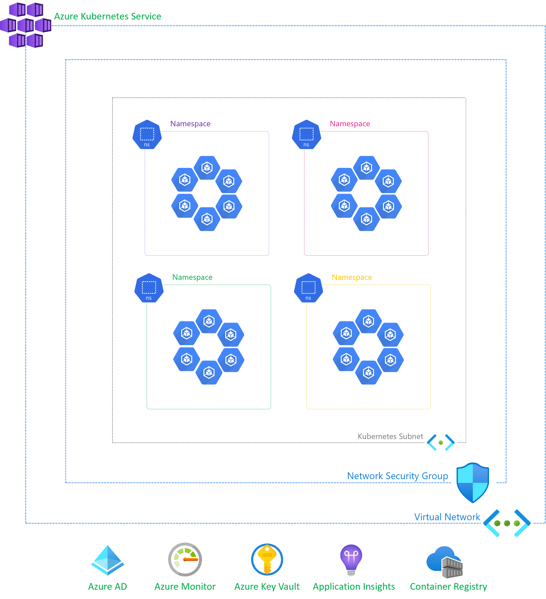
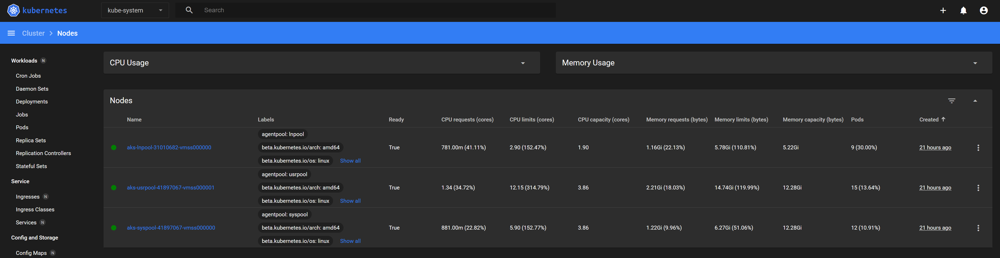

# Azure Kubernetes Service - Getting Started

Mystique Enterprises want to use Azure Kubernetes Service, Can you provide guidance on how to accomplish this?

## 🎯 Solution

The _very_ high level overview of Azure Kubernetes Service looks like this,



1. ## 🧰 Prerequisites

   This demo, along with its instructions, scripts, and Bicep template, has been specifically designed to be executed in the `northeurope` region. However, with minimal modifications, you can also try running it in other regions of your choice (the specific steps for doing so are not covered in this context)

   - 🛠 Azure CLI Installed & Configured - [Get help here](https://learn.microsoft.com/en-us/cli/azure/install-azure-cli)
   - 🛠 Azure Function Core Tools - [Get help here](https://learn.microsoft.com/en-us/azure/azure-functions/functions-run-local?tabs=v4%2Cwindows%2Ccsharp%2Cportal%2Cbash#install-the-azure-functions-core-tools)
   - 🛠 Bicep Installed & Configured - [Get help here](https://learn.microsoft.com/en-us/azure/azure-resource-manager/bicep/install)
     - 🛠 [Optional] VS Code & Bicep Extenstions - [Get help here](https://learn.microsoft.com/en-us/azure/azure-resource-manager/bicep/install#vs-code-and-bicep-extension)
   - `jq` - [Get help here](https://stedolan.github.io/jq/download/)
   - `bash` or git bash - [Get help here](https://git-scm.com/downloads)

2. ## ⚙️ Setting up the environment

   - Get the application code

     ```bash
     git clone https://github.com/miztiik/azure-aks-getting-started.git
     cd azure-aks-getting-started
     ```

3. ## 🚀 Prepare the local environment

   Ensure you have jq, Azure Cli and bicep working

   ```bash
   jq --version
   func --version
   bicep --version
   bash --version
   az account show
   ```

4. ## 🚀 Deploying the Solution

   - **Stack: Main Bicep**
     We will create the following resources
     - **Storage Accounts** for storing the events
       - General purpose Storage Account - Used by Azure functions to store the function code
       - `warehouse*` -  Azure Function will store the events data in this storage account
     - **Managed Identity**
        - This will be used by the Azure Function to interact with other services
     - **Azure Cosmos DB**
        - This will be used by the Azure Function to store the events data
     - **Azure Service Bus Queue**
        - A namespace and a queue will be created. The Azure container instance will use this queue to publish and retrieve events
     - **Azure Container Registry**
        - To host the producer and consumer container images
     - **Azure Kubernetes Service**
        - **Vnet CIDR**: `10.0.0.0/16` 
        - **Node & Pod Subnet CIDR**: `10.0.128.0/19` 
        - **Service CIDR**: `10.0.191.0/24` 
        - **K8s DNS CIDR**: `10.0.191.10` 
        - **Node Count**: `1` in `3` node pools

      Initiate the deployment with the following command,

      ```bash
      # make deploy
      sh deployment_scripts/deploy.sh
      ```

      After successfully deploying the stack, Check the `Resource Groups/Deployments` section for the resources.

5. ## 🔬 Testing the solution

   - **Install Kubernetes Dashboad**

      There is a simple script to install the dashboard. You can find it in here `app/k8s/bootstrap_cluster/deploy_dashboard.sh` folder. 

      ```bash
      sh app/k8s/bootstrap_cluster/setup_kubeconfig.sh
      sh app/k8s/bootstrap_cluster/deploy_dashboard.sh

      # or
      # make spice
      ```

      You should see an output like this, We are sending batch of events every `5` seconds.

      ```text
      Access Dashboard - http://localhost:8001/api/v1/namespaces/kubernetes-dashboard/services/https:kubernetes-dashboard:/proxy/       
      DASHBOARD TOKEN: eyJh...rZbug   
      ```

      


6. ## 📒 Conclusion

    In conclusion, this blog helps you to get started with Azure kubernetes service.
  
7. ## 🧹 CleanUp

   If you want to destroy all the resources created by the stack, Execute the below command to delete the stack, or _you can delete the stack from console as well_

   - Resources created during [Deploying The Solution](#-deploying-the-solution)
   - _Any other custom resources, you have created for this demo_

   ```bash
   # Delete from resource group
   az group delete --name Miztiik_Enterprises_xxx --yes
   # Follow any on-screen prompt
   ```

   This is not an exhaustive list, please carry out other necessary steps as maybe applicable to your needs.

## 📌 Who is using this

This repository aims to show how to Bicep to new developers, Solution Architects & Ops Engineers in Azure.

### 💡 Help/Suggestions or 🐛 Bugs

Thank you for your interest in contributing to our project. Whether it is a bug report, new feature, correction, or additional documentation or solutions, we greatly value feedback and contributions from our community. [Start here](/issues)

### 👋 Buy me a coffee

[](https://ko-fi.com/Q5Q41QDGK) Buy me a [coffee ☕][900].

### 📚 References

1. [Azure Docs - Data Collection Basics of Azure Monitor Application Insights][2]
1. [Azure Docs - Push your first image to your Azure container registry using the Docker CLI][3]

[2]: https://learn.microsoft.com/en-us/azure/azure-monitor/app/opentelemetry-overview
[3]: https://learn.microsoft.com/en-us/azure/container-registry/container-registry-get-started-docker-cli?tabs=azure-cli

### 🏷️ Metadata


**Level**: 200

[100]: https://www.udemy.com/course/aws-cloud-security/?referralCode=B7F1B6C78B45ADAF77A9
[101]: https://www.udemy.com/course/aws-cloud-security-proactive-way/?referralCode=71DC542AD4481309A441
[102]: https://www.udemy.com/course/aws-cloud-development-kit-from-beginner-to-professional/?referralCode=E15D7FB64E417C547579
[103]: https://www.udemy.com/course/aws-cloudformation-basics?referralCode=93AD3B1530BC871093D6
[899]: https://www.udemy.com/user/n-kumar/
[900]: https://ko-fi.com/miztiik
[901]: https://ko-fi.com/Q5Q41QDGK